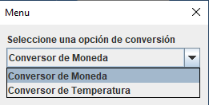
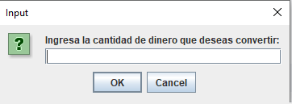
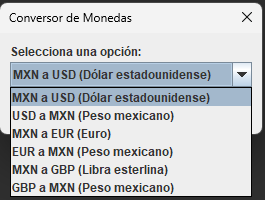

# Conversor de Monedas y Temperaturas

## Descripción

Este es un proyecto de un conversor de monedas y temperaturas desarrollado en Java. El programa permite realizar conversiones entre diferentes monedas y escalas de temperatura.

## Funcionalidades

- Conversor de Monedas:
  - Conversión de MXN (Pesos Mexicanos) a USD (Dólar estadounidense).
  - Conversión de MXN a EUR (Euro).
  - Conversión de MXN a GBP (Libra esterlina).
  - Conversión de USD a MXN.
  - Conversión de EUR a MXN.
  - Conversión de GBP a MXN.

- Conversor de Temperaturas:
  - Conversión de Celsius a Fahrenheit.
  - Conversión de Celsius a Kelvin.
  - Conversión de Fahrenheit a Celsius.
  - Conversión de Fahrenheit a Kelvin.

## Capturas de Pantalla

## Requisitos

- Java Development Kit (JDK) 8 o superior.
- IDE de Java (por ejemplo, Eclipse, IntelliJ) o un editor de texto.

## Cómo usar

1. Clona el repositorio o descarga los archivos del proyecto.
2. Abre el proyecto en tu IDE de Java o editor de texto.
3. Ejecuta la clase `PantallaPrincipal` para iniciar el programa.
4. Selecciona una opción entre "Conversor de monedas" y "Conversor de temperatura".
5. Sigue las instrucciones para realizar las conversiones.

## Contribución

Si deseas contribuir a este proyecto, por favor, sigue los siguientes pasos:

1. Realiza un fork del repositorio.
2. Crea una nueva rama para tus cambios: `git checkout -b nombre-de-la-rama`.
3. Realiza tus modificaciones y mejoras.
4. Haz un commit de tus cambios: `git commit -m "Descripción de tus cambios"`.
5. Hace un push de tus cambios a tu repositorio fork: `git push origin nombre-de-la-rama`.
6. Crea un pull request en este repositorio para que podamos revisar tus cambios.

